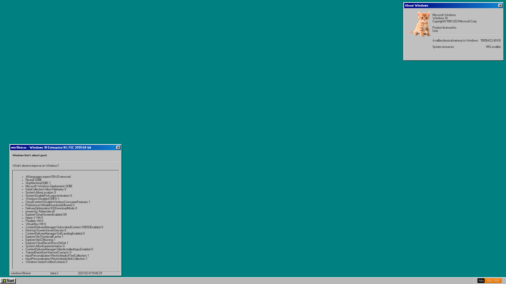

# win10nicer-site 
### a windows95 looking shell in your web browser.
#### pasted together from multiple sources.

**try it out** now @ http://koutsie.github.io/win10nicer-site

--------
~~if you have a solution to make all the divs dragable, please please make a pull request.~~
*Update: i found a way to do it, and it even brings windows to the top while dragging!*
